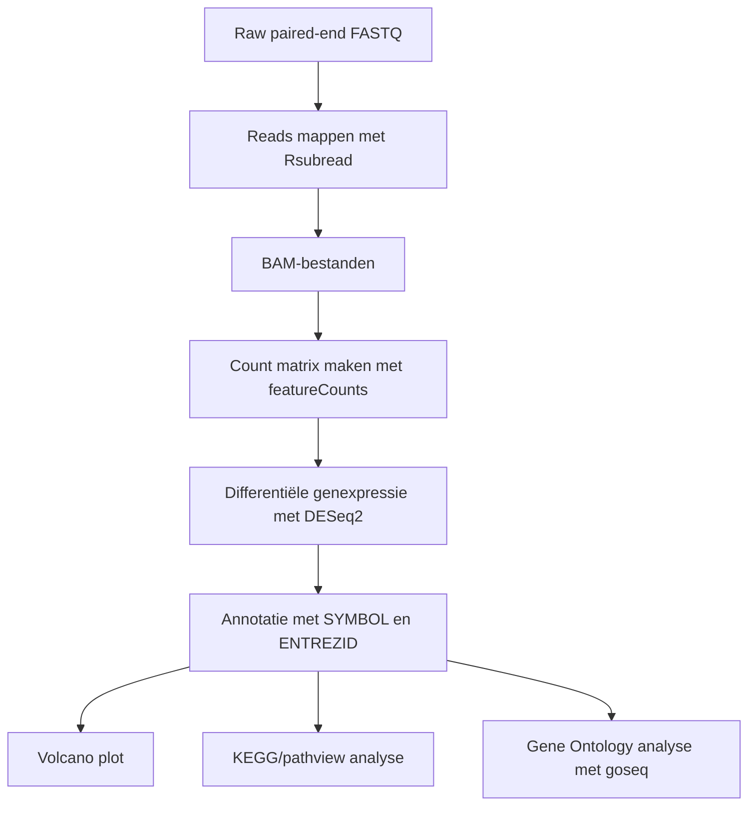

# J2P4-Transcriptomics-RA

RNA-seq analyse van synoviumbiopten van personen met reumatoïde artritis en controlepersonen met behulp van `Rsubread`, `DESeq2`, KEGG/pathview en Gene Ontology analyse met `goseq`.

---

## Inhoud/structuur

Deze repository bevat de uitwerking van de transcriptomics-casus voor J2P4. De analyse is uitgevoerd in R en de repository is gestructureerd zodat data, scripts, resultaten, referenties en beheerdocumentatie gescheiden zijn opgeslagen.

* `Data/Metadata/` – metadata over de gebruikte samples. In deze map staat ook een README met uitleg over de metadata-bestanden.
* `Data/Processed/` – verwerkte data, zoals de officiële count matrix en zelfgemaakte featureCounts-output. In deze map staat ook een README met uitleg over de bestanden.
* `Data/raw_fastq/` – map voor ruwe FASTQ-bestanden. De bestanden zelf zijn niet toegevoegd aan GitHub.
* `Mapped_reads/` – map voor lokaal opgeslagen BAM-bestanden. De bestanden zelf zijn niet toegevoegd aan GitHub.
* `Reference/` – map voor referentiegenoom-, annotatie- en indexbestanden. De bestanden zelf zijn niet toegevoegd aan GitHub.
* `Reference_articles/` – gebruikte literatuurbronnen.
* `Results/Tables/` – resultaat-tabellen uit de analyse.
* `Results/Figures/` – figuren, zoals de volcano plot, GO-dotplot en goseq PWF-plot.
* `Results/Pathways/` – KEGG/pathview-output.
* `Scripts/` – R-scripts voor de transcriptomics-analyse.
* `Data_stewardship/` – uitleg over data stewardship en GitHub-beheer.

---

## Inleiding

Reumatoïde artritis, afgekort RA, is een systemische auto-immuunziekte waarbij ontsteking van het gewrichtsslijmvlies een belangrijke rol speelt. Deze ontsteking wordt ook wel synovitis genoemd en kan uiteindelijk leiden tot gewrichtsschade. De precieze oorzaak van RA is niet volledig bekend, maar genetische aanleg, omgevingsfactoren en een verstoord immuunsysteem spelen waarschijnlijk samen een rol.

In deze casus wordt RNA-seq data gebruikt om verschillen in genexpressie te onderzoeken tussen personen met RA en controlepersonen. Met RNA-seq kan op grote schaal worden bepaald welke genen meer of minder tot expressie komen. Hierdoor kan inzicht worden verkregen in biologische processen en pathways die betrokken zijn bij het ziekteproces.

De gebruikte dataset bestaat uit synoviumbiopten van vier controlepersonen en vier personen met gevestigde RA. De personen met RA zijn ACPA-positief en de controlepersonen zijn ACPA-negatief. Het doel van deze analyse is om met behulp van R te onderzoeken welke genen differentieel tot expressie komen in RA ten opzichte van controle, en welke KEGG-pathways en Gene Ontology-termen hierbij betrokken zijn.

### Onderzoeksvraag

Welke genen, biologische processen en pathways verschillen tussen synoviumbiopten van personen met reumatoïde artritis en controlepersonen?

### Doelstelling

Het doel van dit project is om met behulp van een RNA-seq workflow in R te bepalen welke genen differentieel tot expressie komen in synoviumbiopten van personen met reumatoïde artritis ten opzichte van controlepersonen. Daarnaast wordt onderzocht welke biologische processen en pathways betrokken zijn bij deze genexpressieveranderingen.

### Deelvragen

1. Welke genen komen significant hoger of lager tot expressie in RA ten opzichte van controle?
2. Welke KEGG-pathways overlappen met de significant differentieel tot expressie komende genen?
3. Welke Gene Ontology-termen zijn oververtegenwoordigd in de significante genen wanneer rekening wordt gehouden met gene-length bias met `goseq`?
4. Hoe kan de RNA-seq analyse reproduceerbaar en transparant worden beheerd met GitHub?

---

## Methode

De analyse is uitgevoerd in R. De ruwe sequencingdata bestond uit paired-end FASTQ-bestanden van acht samples. Eerst zijn de reads gemapt tegen het humane referentiegenoom met het R-package `Rsubread`. Voor deze analyse is het humane NCBI RefSeq referentiegenoom GRCh38.p14 gebruikt, met assembly accession `GCF_000001405.40_GRCh38.p14`. De FASTA- en GTF-bestanden zijn van dezelfde bron gebruikt, zodat het referentiegenoom en de annotatie met elkaar overeenkomen.

Na het mappen zijn de BAM-bestanden gebruikt om met `featureCounts` een count matrix te maken. Deze zelfgemaakte count matrix is opgeslagen in `Data/Processed/RA_countmatrix_NCBI_GRCh38p14_subset40k.csv` en laat zien hoe de count matrix vanuit gemapte reads kan worden opgebouwd.

Voor de uiteindelijke differentiële genexpressieanalyse is het bestand `Data/Processed/count_matrix_RA.txt` gebruikt als officiële input voor `DESeq2`. Deze count matrix bevat per gen het aantal reads per sample. De count matrix is ingelezen in R, omgezet naar een integer matrix en gekoppeld aan de samplemetadata. In DESeq2 is de conditie `control` ingesteld als referentiegroep. Hierdoor betekent een positieve `log2FoldChange` dat een gen hoger tot expressie komt in RA ten opzichte van controle.

Significante genen zijn geselecteerd op basis van `padj < 0.05` en `|log2FoldChange| > 1`. Daarna zijn de resultaten geannoteerd met Entrez ID’s met behulp van `org.Hs.eg.db` en `AnnotationDbi`. Voor visualisatie is een volcano plot gemaakt met `EnhancedVolcano`. Daarnaast is met `pathview` de KEGG-pathway voor reumatoïde artritis gevisualiseerd.

Voor de Gene Ontology analyse is gebruikgemaakt van `goseq`. Deze methode is gekozen omdat `goseq` specifiek geschikt is voor GO-analyse van RNA-seq data en rekening kan houden met gene-length bias. Bij RNA-seq hebben langere genen namelijk een grotere kans om als differentieel tot expressie komend gen gedetecteerd te worden. Hierdoor kunnen standaard over-representation analyses vertekende GO-resultaten geven.

Voor de `goseq`-analyse zijn genlengtes bepaald uit het gebruikte NCBI RefSeq GTF-bestand (`Reference/genomic.gtf`). Hiervoor zijn de exonregio’s per gen samengevoegd en is per gen de totale exonlengte berekend. Van de 19.872 betrouwbaar geteste genen konden 17.551 genen gekoppeld worden aan een genlengte uit de GTF. Binnen deze set waren 4.286 genen significant differentieel tot expressie komend.

Daarna is een binaire genenlijst gemaakt voor `goseq`, waarbij significante genen de waarde 1 kregen en niet-significante betrouwbaar geteste genen de waarde 0. Met `nullp()` is een Probability Weighting Function (PWF) berekend om te corrigeren voor lengtebias. Vervolgens is met `goseq()` en de Wallenius-methode onderzocht welke GO-termen oververtegenwoordigd waren binnen de drie GO-ontologieën: Biological Process (BP), Molecular Function (MF) en Cellular Component (CC). De p-waarden zijn gecorrigeerd met de Benjamini-Hochberg methode.

De PWF-plot van `goseq` is opgeslagen als aanvullende controlefiguur:

* [goseq PWF plot](Results/Figures/goseq_PWF_RA_vs_control.png)

Het volledige R-script waarmee de analyse is uitgevoerd staat in:

* [Transcriptomics RA workflow script](Scripts/transcriptomics_RA_workflow.R)

### Globale workflow

---

## Resultaten

Na het uitvoeren van de DESeq2-analyse zijn de RA-samples vergeleken met de controles. Hierbij was de controlegroep ingesteld als referentiegroep. Een positieve `log2FoldChange` betekent daarom dat een gen hoger tot expressie komt in RA ten opzichte van controle, terwijl een negatieve `log2FoldChange` betekent dat een gen lager tot expressie komt in RA.

Op basis van de criteria `padj < 0.05` en `|log2FoldChange| > 1` zijn in totaal **4528 differentieel tot expressie komende genen** gevonden. Hiervan kwamen **2057 genen hoger tot expressie in RA** en **2471 genen lager tot expressie in RA**. De volledige DESeq2-resultaten en de lijst met significante genen zijn opgeslagen in de map `Results/Tables/`.

Belangrijke resultaatbestanden zijn:

* [DESeq2 resultaten](Results/Tables/DESeq2_resultaten_RA_vs_control.csv)
* [Aantal differentieel tot expressie komende genen](Results/Tables/DEG_aantallen_RA_vs_control.csv)
* [Significante genen met Entrez ID](Results/Tables/significante_genen_RA_vs_control_met_EntrezID.csv)

### Volcano plot

De volcano plot laat per gen de `log2FoldChange` en aangepaste p-waarde zien. Genen die hoger tot expressie komen in RA liggen rechts van het midden. Genen die lager tot expressie komen in RA liggen links van het midden. De rode punten voldoen aan zowel de p-waardegrens als de fold change-grens.

In de volcano plot is te zien dat er veel genen significant verschillen tussen RA en controle. Sterk significant lager tot expressie komende genen zijn onder andere `ANKRD30BL`, `MT-ND6`, `RAB3IL1`, `SLC9A3R2` en `ZNF598`. Aan de rechterkant van de plot is onder andere `SRGN` zichtbaar als gen met hogere expressie in RA.

Daarnaast kwamen in de lijst met sterk hoger tot expressie komende genen meerdere immunoglobuline-gerelateerde genen naar voren, zoals `IGHV3-53`, `IGKV1-39`, `IGKV3D-15`, `IGHV6-1` en `IGHV1-69`. Dit wijst op betrokkenheid van B-cellen, antistoffen en adaptieve immuunprocessen in het RA-synovium.

### Gene Ontology analyse met goseq

De Gene Ontology analyse is uitgevoerd met `goseq` om te onderzoeken welke biologische processen, moleculaire functies en cellulaire componenten oververtegenwoordigd zijn in de lijst met significante genen. Hierbij is rekening gehouden met gene-length bias op basis van genlengtes uit het GTF-bestand.

In totaal zijn **215 significante GO-termen** gevonden voor Biological Process, **8 GO-termen** voor Molecular Function en **7 GO-termen** voor Cellular Component.

De GO Biological Process-resultaten laten vooral termen zien die te maken hebben met immuunactiviteit. Belangrijke termen zijn onder andere:

* `adaptive immune response`
* `immune system process`
* `immune response`
* `leukocyte activation`
* `cell activation`
* `lymphocyte activation`
* `B cell mediated immunity`
* `adaptive immune response based on somatic recombination of immune receptors built from immunoglobulin superfamily domains`
* `immunoglobulin mediated immune response`

De GO-dotplot laat zien dat vooral brede immuunprocessen, leukocytactivatie, lymfocytactivatie, adaptieve immuunrespons en B-cel-gemedieerde immuniteit verrijkt zijn.

De GO Molecular Function-resultaten bevatten onder andere `antigen binding`, `immunoglobulin receptor binding`, `GTPase binding` en `enzyme binding`. De GO Cellular Component-resultaten bevatten vooral termen zoals `immunoglobulin complex`, `IgG immunoglobulin complex`, `IgM immunoglobulin complex`, `immunoglobulin complex, circulating`, `extracellular region` en `plasma membrane signaling receptor complex`.

Samen ondersteunen deze resultaten dat immuunactivatie, antigeenbinding, B-celactiviteit en immunoglobuline-gerelateerde processen sterk aanwezig zijn in de differentieel tot expressie komende genen.

De significante GO-resultaten zijn opgeslagen in:

* [GO Biological Process](Results/Tables/GO_Biological_Process_RA_vs_control.csv)
* [GO Molecular Function](Results/Tables/GO_Molecular_Function_RA_vs_control.csv)
* [GO Cellular Component](Results/Tables/GO_Cellular_Component_RA_vs_control.csv)

Daarnaast zijn de volledige goseq-resultaten, inclusief niet-significante GO-termen, opgeslagen in:

* [GO Biological Process alle goseq-resultaten](Results/Tables/GO_Biological_Process_RA_vs_control_all_goseq.csv)
* [GO Molecular Function alle goseq-resultaten](Results/Tables/GO_Molecular_Function_RA_vs_control_all_goseq.csv)
* [GO Cellular Component alle goseq-resultaten](Results/Tables/GO_Cellular_Component_RA_vs_control_all_goseq.csv)

### KEGG-pathwayanalyse

Voor de KEGG-analyse is gekeken welke pathways overlap hebben met de significante genen. Daarnaast is de KEGG-pathway voor reumatoïde artritis (`hsa05323`) gevisualiseerd met `pathview`.

In de KEGG-visualisatie geeft rood een hogere expressie in RA aan en groen een lagere expressie in RA. In de RA-pathway zijn meerdere ontstekings- en immuungerelateerde genen hoger tot expressie in RA, waaronder `IFNG`, `CD80/86`, `MHCII`, `CD28`, `CTLA4`, `IL6`, `IL1B`, `IL8`, `CCL2`, `CCL3`, `CXCL1`, `CXCL5`, `TLR2/4` en `MMP1/3`. Dit wijst op verhoogde ontstekings- en immuunsignalering in de RA-samples.

De KEGG-overlapresultaten bevatten meerdere pathways die passen bij ontsteking, immuunactivatie en celsignalering. Voorbeelden hiervan zijn:

* `Cytokine-cytokine receptor interaction`
* `MAPK signaling pathway`
* `PI3K-Akt signaling pathway`
* `NOD-like receptor signaling pathway`
* `Chemokine signaling pathway`
* `TNF signaling pathway`
* `NF-kappa B signaling pathway`
* `Th17 cell differentiation`
* `T cell receptor signaling pathway`
* `B cell receptor signaling pathway`
* `Antigen processing and presentation`
* `Rheumatoid arthritis`

Deze resultaten moeten worden geïnterpreteerd als overlap met KEGG-pathways. Het bestand `KEGG_pathways_met_overlap.csv` bevat aantallen overlappende genen per pathway, maar dit is geen volledige statistische KEGG-enrichmentanalyse met p-waarden.

Het KEGG-resultaatbestand staat hier:

* [KEGG pathways met overlap](Results/Tables/KEGG_pathways_met_overlap.csv)

---

## Conclusie

Met behulp van RNA-seq analyse zijn duidelijke verschillen in genexpressie gevonden tussen synoviumbiopten van personen met reumatoïde artritis en controlepersonen. In totaal zijn **4528 differentieel tot expressie komende genen** gevonden, waarvan **2057 genen hoger tot expressie kwamen in RA** en **2471 genen lager tot expressie kwamen in RA**.

De biologische interpretatie van de resultaten wijst vooral richting immuunactiviteit. De GO-analyse met `goseq` liet verrijking zien van processen zoals `adaptive immune response`, `immune system process`, `immune response`, `leukocyte activation`, `lymphocyte activation` en `B cell mediated immunity`. Ook de Molecular Function- en Cellular Component-resultaten ondersteunen dit beeld, doordat termen zoals `antigen binding`, `immunoglobulin receptor binding` en `immunoglobulin complex` naar voren kwamen.

De KEGG-resultaten sluiten hierbij aan. Er was overlap met meerdere immuun- en ontstekingsgerelateerde pathways, zoals `cytokine-cytokine receptor interaction`, `chemokine signaling pathway`, `TNF signaling pathway`, `NF-kappa B signaling pathway`, `Th17 cell differentiation` en de `rheumatoid arthritis` pathway. In de KEGG RA-pathway waren meerdere ontstekingsgerelateerde genen hoger tot expressie in RA, waaronder cytokines, chemokines en genen die betrokken zijn bij T-celactivatie en ontstekingssignalering.

Samen passen deze resultaten bij RA als auto-immuunziekte waarbij synovitis, immuunactivatie, B-celactiviteit, T-celactiviteit en ontstekingsprocessen een belangrijke rol spelen. Een beperking van deze analyse is dat er maar acht samples zijn gebruikt en dat er gewerkt is met subset40k FASTQ-bestanden. De resultaten zijn daarom vooral geschikt om de transcriptomics-workflow te demonstreren en moeten voorzichtig biologisch geïnterpreteerd worden.

Daarnaast konden niet alle betrouwbaar geteste genen worden meegenomen in de `goseq`-analyse, omdat niet voor elk gen een genlengte of GO-annotatie beschikbaar was. Van de 19.872 betrouwbaar geteste genen konden 17.551 genen gekoppeld worden aan een genlengte uit de GTF. Binnen deze set waren 4.286 genen significant differentieel tot expressie komend. Deze beperking is meegenomen bij de interpretatie van de GO-resultaten.

Vervolgonderzoek zou kunnen bestaan uit analyse van een grotere dataset, validatie van interessante genen met qPCR en een volledige statistische pathway-enrichmentanalyse voor KEGG of andere pathways. Ondanks deze beperkingen laat deze analyse zien hoe RNA-seq gebruikt kan worden om ziekte-gerelateerde genexpressiepatronen bij reumatoïde artritis te onderzoeken.

---

## Data stewardship en beheer

Voor de competentie beheren zijn aparte documenten toegevoegd waarin wordt uitgelegd hoe de projectgegevens en scripts zijn beheerd:

* [Data stewardship / beheren](Data_stewardship/Beheren.md)
* [GitHub beheer](Data_stewardship/GitHub_beheer.md)

In dit project is onderscheid gemaakt tussen ruwe data, tussenbestanden, verwerkte data, resultaten, scripts en documentatie. Grote bestanden zoals FASTQ-, BAM- en referentiebestanden zijn niet toegevoegd aan GitHub en worden uitgesloten via `.gitignore`. De mappen waarin deze bestanden lokaal horen te staan bevatten wel een README-bestand met uitleg.

---

## Gebruikte software en packages

De analyse is uitgevoerd in R/RStudio. De belangrijkste gebruikte packages zijn:

* `Rsubread`
* `Rsamtools`
* `DESeq2`
* `KEGGREST`
* `EnhancedVolcano`
* `pathview`
* `org.Hs.eg.db`
* `AnnotationDbi`
* `goseq`
* `rtracklayer`
* `GenomicRanges`
* `GO.db`
* `ggplot2`

De volledige R-sessie, RStudio-versie en gebruikte package-versies zijn opgeslagen in:

* [sessionInfo_transcriptomics_RA.txt](Results/sessionInfo_transcriptomics_RA.txt)

Deze informatie is toegevoegd om de analyse beter reproduceerbaar te maken.

---

## Bronnen

Gabriel, S. E. (2001). *The epidemiology of rheumatoid arthritis*. Rheumatic Disease Clinics of North America, 27(2), 269–281. doi:10.1016/S0889-857X(05)70201-5

Majithia, V., & Geraci, S. A. (2007). *Rheumatoid arthritis: Diagnosis and management*. The American Journal of Medicine, 120(11), 936–939. doi:10.1016/j.amjmed.2007.04.005

Platzer, A., Nussbaumer, T., Karonitsch, T., Smolen, J. S., & Aletaha, D. (2019). *Analysis of gene expression in rheumatoid arthritis and related conditions offers insights into sex-bias, gene biotypes and co-expression patterns*. PLOS ONE, 14(7), e0219698. doi:10.1371/journal.pone.0219698

Radu, A.-F., & Bungau, S. G. (2021). *Management of rheumatoid arthritis: An overview*. Cells, 10(11), 2857. doi:10.3390/cells10112857

Young, M. D., Wakefield, M. J., Smyth, G. K., & Oshlack, A. (2010). *Gene ontology analysis for RNA-seq: Accounting for selection bias*. Genome Biology, 11, R14. https://doi.org/10.1186/gb-2010-11-2-r14
