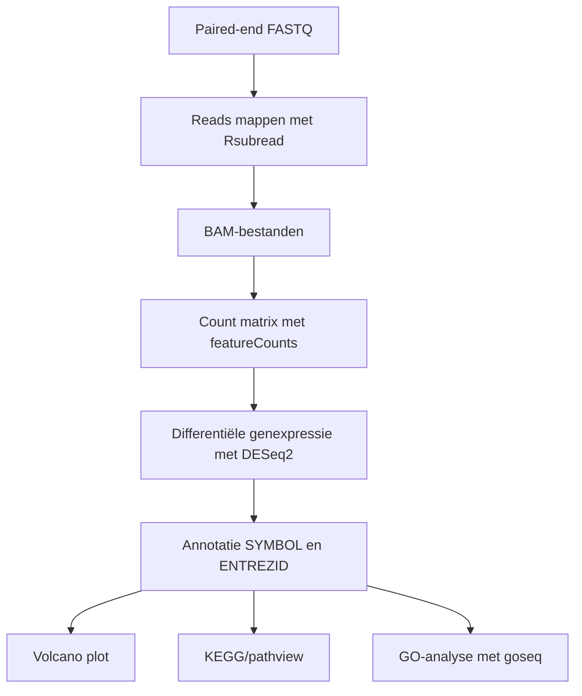
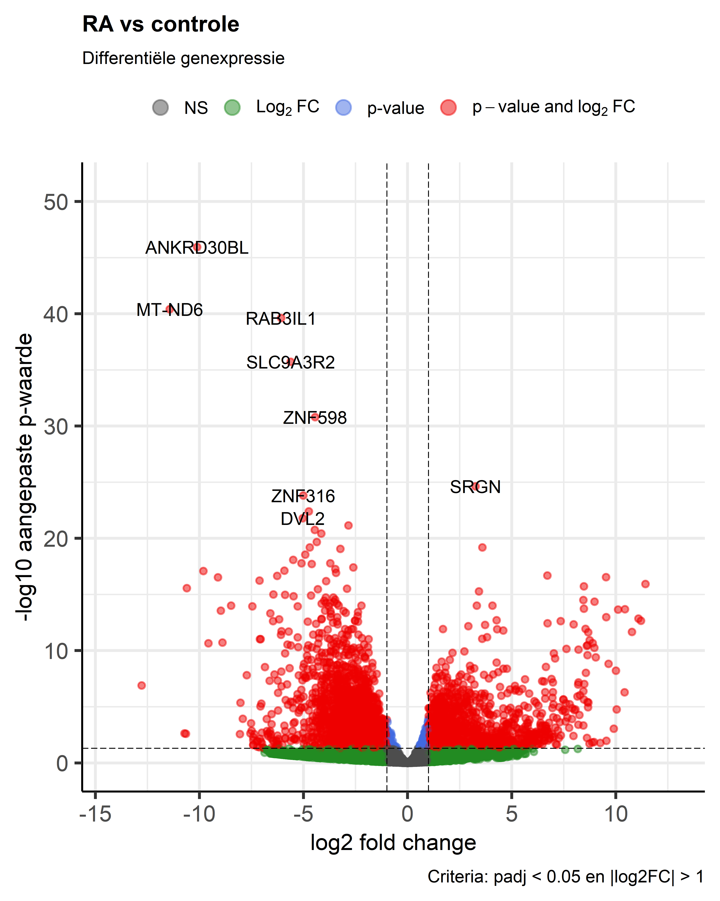
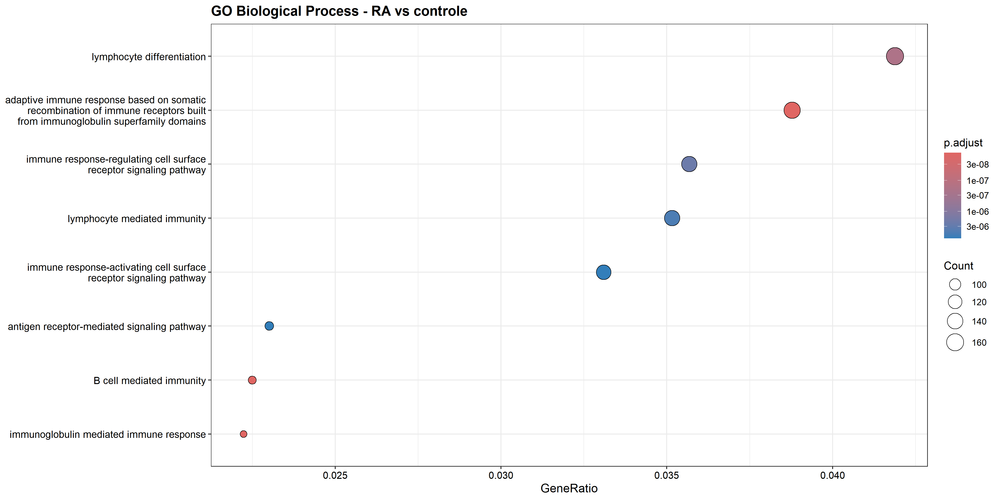
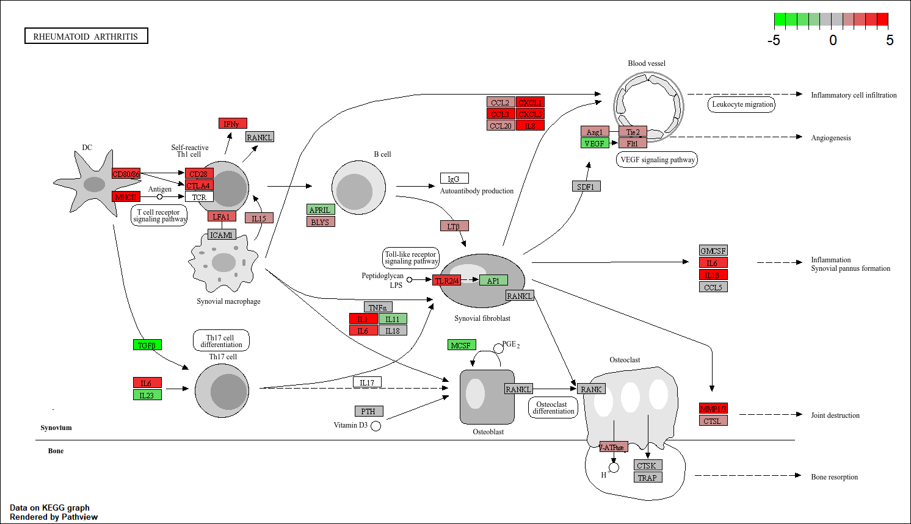

# RNA-seq laat verhoogde immuunactivatie zien in RA-synovium

Deze repository bevat een RNA-seq analyse van synoviumbiopten van personen met reumatoïde artritis (RA) en controlepersonen. Het doel was om te bepalen welke genen hoger of lager tot expressie komen in RA, en welke biologische processen en pathways daarbij betrokken zijn.

---

## Snel naar bestanden

* [R-script](Scripts/transcriptomics_RA_workflow.R)
* [SessionInfo en packageversies](Results/sessionInfo_transcriptomics_RA.txt)
* [Metadata](Data/Metadata/sample_metadata_RA.csv)
* [DESeq2 top 25 resultaten](Results/Tables/DESeq2_top25_laagste_padj_RA_vs_control.csv)
* [Volledige DESeq2 resultaten](Results/Tables/DESeq2_resultaten_RA_vs_control.csv)
* [GO-resultaten](Results/Tables/GO_Biological_Process_RA_vs_control.csv)
* [KEGG-overlap](Results/Tables/KEGG_pathways_met_overlap.csv)
* [Data stewardship](Data_stewardship/Beheren.md)
* [GitHub beheer](Data_stewardship/GitHub_beheer.md)

---

## Inleiding en doel

Reumatoïde artritis (RA) is een chronische systemische auto-immuunziekte waarbij ontsteking van het synovium, ook wel synovitis, centraal staat ([Radu & Bungau, 2021](Reference_articles/Radu_Bungau_2021_RA_management.pdf)). RA komt wereldwijd naar schatting voor bij ongeveer 0,5–1,0% van de bevolking, waardoor het een relevante auto-immuunziekte is om op moleculair niveau te onderzoeken ([Gabriel, 2001](Reference_articles/Gabriel_2001_RA_epidemiology.pdf)). De ziekte kan leiden tot pijn, stijfheid en blijvende gewrichtsschade. Vroege herkenning en behandeling zijn daarom belangrijk ([Majithia & Geraci, 2007](Reference_articles/Majithia_Geraci_2007_RA_diagnosis_management.pdf); [Radu & Bungau, 2021](Reference_articles/Radu_Bungau_2021_RA_management.pdf)).

Transcriptomics kan helpen om RA beter te begrijpen, omdat RNA-seq laat zien welke genen actief zijn in ziek en gezond weefsel. Eerder onderzoek liet zien dat synoviumweefsel gebruikt kan worden om RA-gerelateerde genexpressiepatronen te onderzoeken en om verschillen tussen RA en verwante aandoeningen zichtbaar te maken ([Platzer et al., 2019](Reference_articles/Platzer_2019_RA_gene_expression.pdf)).

Het doel van dit project was om met een reproduceerbare RNA-seq workflow te onderzoeken welke genen hoger of lager tot expressie komen in RA-synovium ten opzichte van controles. Daarnaast is onderzocht welke Gene Ontology-termen en KEGG-pathways gekoppeld zijn aan deze differentieel tot expressie komende genen. Hiermee wordt antwoord gegeven op de vraag welke genen, biologische processen en pathways verschillen tussen synoviumbiopten van RA-patiënten en controlepersonen.

---

## Methode

De analyse is uitgevoerd in **R 4.5.3**. De volledige R-sessie met packageversies staat in [sessionInfo_transcriptomics_RA.txt](Results/sessionInfo_transcriptomics_RA.txt). De ruwe data bestond uit paired-end RNA-seq FASTQ-bestanden uit de dataset van [Platzer et al. (2019)](Reference_articles/Platzer_2019_RA_gene_expression.pdf). Voor de praktische workflow is gewerkt met subset40k FASTQ-bestanden van acht SRA-runs: vier controles (`SRR4785819`, `SRR4785820`, `SRR4785828`, `SRR4785831`) en vier RA-samples (`SRR4785979`, `SRR4785980`, `SRR4785986`, `SRR4785988`).

De reads zijn gemapt met `Rsubread` tegen het humane NCBI RefSeq referentiegenoom GRCh38.p14 (`GCF_000001405.40_GRCh38.p14`) ([Liao et al., 2019](Reference_articles/Liao_2019_Rsubread_RNAseq_alignment_quantification.pdf)). Met `featureCounts` is een eigen count matrix gemaakt als onderdeel van de workflow. Voor de differentiële genexpressieanalyse is `Data/Processed/count_matrix_RA.txt` gebruikt.

Met `DESeq2` is RA vergeleken met controle ([Love et al., 2014](Reference_articles/Love_2014_DESeq2_differential_expression.pdf)). De controlegroep is ingesteld als referentie, waardoor een positieve `log2FoldChange` hogere expressie in RA betekent. Significante genen zijn geselecteerd met `padj < 0.05` en `|log2FoldChange| > 1`.

Voor functionele interpretatie zijn genen geannoteerd met `org.Hs.eg.db` en `AnnotationDbi`. De KEGG RA-pathway is gevisualiseerd met `pathview` ([Luo & Brouwer, 2013](Reference_articles/Luo_Brouwer_2013_pathview_pathway_visualization.pdf)). De GO-analyse is uitgevoerd met `goseq`, omdat deze methode rekening houdt met gene-length bias bij RNA-seq data ([Young et al., 2010]([Young et al., 2010](Reference_articles/Young_2010_goseq_gene_ontology_selection_bias.pdf)).

De bijbehorende PWF-plot staat hier: [goseq PWF plot](Results/Figures/goseq_PWF_RA_vs_control.png).

---

## Resultaten

### Differentiële genexpressie

Met DESeq2 zijn **4528 differentieel tot expressie komende genen** gevonden. Daarvan kwamen **2057 genen hoger** en **2471 genen lager** tot expressie in RA ten opzichte van controle. Omdat de volledige DESeq2-tabel groot is, is ook een kleinere top 25-tabel toegevoegd met de genen met de laagste aangepaste p-waarde.

De volcano plot laat zien dat er aan beide kanten veel significant veranderde genen aanwezig zijn.

*Figuur 1. Volcano plot van RA versus controle. Rode punten voldoen aan `padj < 0.05` en `|log2FoldChange| > 1`. Rechts staan genen met hogere expressie in RA en links genen met lagere expressie in RA.*

De sterkst hoger tot expressie komende genen waren vooral immunoglobuline-gerelateerde genen, zoals `IGHV3-53`, `IGKV1-39`, `IGKV3D-15`, `IGHV6-1` en `IGHV1-69`. Dit wijst op betrokkenheid van B-cellen en antistof-gerelateerde processen.

### Gene Ontology analyse

Met `goseq` zijn **215 significante Biological Process-termen**, **8 Molecular Function-termen** en **7 Cellular Component-termen** gevonden. De belangrijkste Biological Process-termen wijzen vooral op immuunactivatie, waaronder `immune system process`, `immune response`, `cell activation`, `leukocyte activation`, `lymphocyte activation`, `adaptive immune response` en `B cell mediated immunity`.

*Figuur 2. GO Biological Process-dotplot na correctie voor gene-length bias met `goseq`. De verrijkte termen wijzen vooral op immuunrespons, leukocytactivatie, lymfocytactivatie en B-cel-gemedieerde immuniteit.*

De Molecular Function- en Cellular Component-resultaten ondersteunen dit beeld, met termen zoals `antigen binding`, `immunoglobulin receptor binding` en `immunoglobulin complex`.

### KEGG-pathwayanalyse

De KEGG RA-pathway (`hsa05323`) is gevisualiseerd met `pathview`. In deze pathway kwamen meerdere ontstekings- en immuungerelateerde genen hoger tot expressie in RA, waaronder `IFNG`, `CD80/86`, `MHCII`, `CD28`, `CTLA4`, `IL6`, `IL1B`, `IL8`, `CCL2`, `CCL3`, `CXCL1`, `CXCL5`, `TLR2/4` en `MMP1/3`.

*Figuur 3. KEGG RA-pathway met `pathview`. Rood geeft hogere expressie in RA aan en groen lagere expressie in RA. De figuur laat verhoogde ontstekings- en immuunsignalering in RA zien.*

De KEGG-overlapresultaten bevatten onder andere cytokine-, chemokine-, TNF-, NF-kappa B-, Th17-, T-cel- en B-cel-gerelateerde pathways. Dit is geïnterpreteerd als pathway-overlap en niet als volledige statistische KEGG-enrichmentanalyse.

---

## Conclusie

De RNA-seq analyse laat duidelijke verschillen zien tussen RA-synovium en controles. De belangrijkste bevinding is dat RA-synovium wordt gekenmerkt door verhoogde immuunactivatie. Dit blijkt uit differentiële expressie van immunoglobuline-gerelateerde genen, verrijking van GO-termen rond immuunrespons en B-celactiviteit, en overlap met KEGG-pathways voor ontstekings- en immuunsignalering.

Deze resultaten passen bij RA als auto-immuunziekte waarbij synovitis, immuuncelactivatie en chronische ontsteking centraal staan. Een beperking is dat de analyse is uitgevoerd met acht samples en subset40k FASTQ-bestanden. De resultaten zijn daarom vooral geschikt om de RNA-seq workflow en biologische interpretatie te demonstreren. Vervolgonderzoek kan bestaan uit analyse van een grotere dataset, validatie van relevante genen met qPCR en een volledige statistische pathway-enrichmentanalyse.

---

## Data stewardship en reproduceerbaarheid

De repository is ingericht om de analyse reproduceerbaar en transparant te beheren. Ruwe FASTQ-bestanden, BAM-bestanden en referentiebestanden zijn vanwege bestandsgrootte niet toegevoegd aan GitHub en worden uitgesloten via `.gitignore`. De mappen bevatten wel README-bestanden waarin staat welke bestanden lokaal nodig zijn. Scripts, metadata, verwerkte tabellen, figuren en sessionInfo zijn wel opgenomen.

De volledige uitleg staat in:

* [Data stewardship / beheren](Data_stewardship/Beheren.md)
* [GitHub beheer](Data_stewardship/GitHub_beheer.md)

---

## AI-gebruik

Tijdens dit project is ChatGPT gebruikt als hulpmiddel bij het structureren van de GitHub-pagina, het controleren van R-code, het verbeteren van formuleringen en het verwerken van feedback. De analyses zijn uitgevoerd in R en de resultaten zijn gecontroleerd aan de hand van de gegenereerde tabellen, figuren en console-output. De uiteindelijke keuzes, interpretatie en inhoudelijke controle zijn zelf uitgevoerd.

---

## Gebruikte software en packages

Belangrijkste software en packages: R 4.5.3, RStudio, `Rsubread`, `Rsamtools`, `DESeq2`, `KEGGREST`, `EnhancedVolcano`, `pathview`, `org.Hs.eg.db`, `AnnotationDbi`, `goseq`, `rtracklayer`, `GenomicRanges`, `GO.db` en `ggplot2`.

De volledige R-sessie staat in [sessionInfo_transcriptomics_RA.txt](Results/sessionInfo_transcriptomics_RA.txt).

---

## Bronnen

Gabriel, S. E. (2001). *The epidemiology of rheumatoid arthritis*. Rheumatic Disease Clinics of North America, 27(2), 269–281. https://doi.org/10.1016/S0889-857X(05)70201-5

Liao, Y., Smyth, G. K., & Shi, W. (2019). *The R package Rsubread is easier, faster, cheaper and better for alignment and quantification of RNA sequencing reads*. Nucleic Acids Research, 47(8), e47. https://doi.org/10.1093/nar/gkz114

Love, M. I., Huber, W., & Anders, S. (2014). *Moderated estimation of fold change and dispersion for RNA-seq data with DESeq2*. Genome Biology, 15, 550. https://doi.org/10.1186/s13059-014-0550-8

Luo, W., & Brouwer, C. (2013). *Pathview: an R/Bioconductor package for pathway-based data integration and visualization*. Bioinformatics, 29(14), 1830–1831. https://doi.org/10.1093/bioinformatics/btt285

Majithia, V., & Geraci, S. A. (2007). *Rheumatoid arthritis: Diagnosis and management*. The American Journal of Medicine, 120(11), 936–939. https://doi.org/10.1016/j.amjmed.2007.04.005

Platzer, A., Nussbaumer, T., Karonitsch, T., Smolen, J. S., & Aletaha, D. (2019). *Analysis of gene expression in rheumatoid arthritis and related conditions offers insights into sex-bias, gene biotypes and co-expression patterns*. PLOS ONE, 14(7), e0219698. https://doi.org/10.1371/journal.pone.0219698

Radu, A.-F., & Bungau, S. G. (2021). *Management of rheumatoid arthritis: An overview*. Cells, 10(11), 2857. https://doi.org/10.3390/cells10112857

Young, M. D., Wakefield, M. J., Smyth, G. K., & Oshlack, A. (2010). *Gene ontology analysis for RNA-seq: Accounting for selection bias*. Genome Biology, 11, R14. https://doi.org/10.1186/gb-2010-11-2-r14
